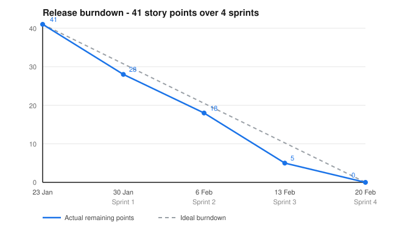

# Burndown

The live per-sprint burndown charts are generated by Taiga from the board data:
[tree.taiga.io/project/pablova02-stockmaster-inventory](https://tree.taiga.io/project/pablova02-stockmaster-inventory).

This page keeps the **release burndown** of the four development sprints in the
repository, so that the progress can be read without opening the board.

## Data

41 story points were committed across the four sprints. The remaining points are measured at
the end of each sprint.

| Date | Milestone | Points closed in the sprint | Remaining | Ideal |
|---|---|---|---|---|
| 23 Jan 2026 | Start | — | 41 | 41.00 |
| 30 Jan 2026 | End of Sprint 1 | 13 | 28 | 30.75 |
| 6 Feb 2026 | End of Sprint 2 | 10 | 18 | 20.50 |
| 13 Feb 2026 | End of Sprint 3 | 13 | 5 | 10.25 |
| 20 Feb 2026 | End of Sprint 4 | 10 | 0 | 0.00 |

## Reading the chart

The actual line stays **above** the ideal line for the whole project: the team was behind the
even pace at the end of every intermediate sprint and only caught up in the last one. Sprint 3
closed 13 points, the same as Sprint 1, but did it in a single working session rather than
spread over the week.

The commit distribution shows the same thing:

| Sprint | Commits | Concentration |
|---|---|---|
| 1 | 4 | 29–30 January |
| 2 | 15 | 2–3 February |
| 3 | 29 | 11 February |
| 4 | 3 | 17 February |

Each sprint delivered its increment, but the work inside the sprint was concentrated in one or
two days instead of being spread across the week. This is the main process weakness of the
project and it is discussed in [retrospective.md](retrospective.md).
