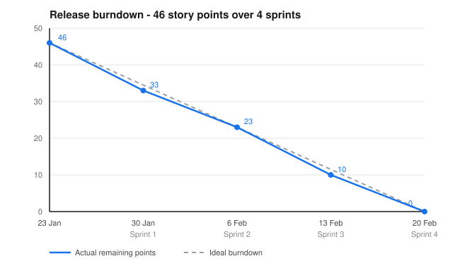

# Burndown

The live per-sprint burndown charts are generated by Taiga from the board data:
[tree.taiga.io/project/pablova02-stockmaster-inventory](https://tree.taiga.io/project/pablova02-stockmaster-inventory).

This page keeps the **release burndown** of the four development sprints in the
repository, so that the progress can be read without opening the board.

## Data

46 story points were committed across the four sprints. The remaining points are measured at
the end of each sprint.

| Date | Milestone | Points closed in the sprint | Remaining | Ideal |
|---|---|---|---|---|
| 23 Jan 2026 | Start | — | 46 | 46.00 |
| 30 Jan 2026 | End of Sprint 1 | 13 | 33 | 34.50 |
| 6 Feb 2026 | End of Sprint 2 | 10 | 23 | 23.00 |
| 13 Feb 2026 | End of Sprint 3 | 13 | 10 | 11.50 |
| 20 Feb 2026 | End of Sprint 4 | 10 | 0 | 0.00 |

## Reading the chart

The actual line tracks the ideal one closely: slightly ahead after Sprint 1, exactly on the
even pace after Sprint 2, slightly ahead again after Sprint 3. Read on its own, the release
burndown says the scope was estimated well and delivered at a steady rate.

That is also its limitation, and it is worth saying out loud: a release burndown measured only
at the end of each sprint cannot show *when* inside the sprint the work happened. The commit
distribution below shows what the chart hides.

The commit distribution shows the same thing:

| Sprint | Commits | Concentration |
|---|---|---|
| 1 | 4 | 29–30 January |
| 2 | 15 | 2–3 February |
| 3 | 29 | 11 February |
| 4 | 3 | 17 February |

Each sprint delivered its increment, but the work inside the sprint was concentrated in one or
two days instead of being spread across the week. This is the main process weakness of the
project and it is discussed in [retrospective.md](retrospective.md).

## The September iterations

The corrective work after the February review is not part of the release burndown above: it
adds no new functional scope, it repairs the increments that were already accepted. It is
recorded here for completeness.

| Iteration | Dates | Points | Commits |
|---|---|---|---|
| Post-review remediation | 30 Aug – 5 Sep 2026 | 37 | 25 |
| Delivery readiness | 5 – 8 Sep 2026 | 3 | 6 |

Both closed their whole scope. The corrective iteration also fixed the process weakness the
chart above hides: its 25 commits are spread over six of its seven days, instead of landing in
a single session.
