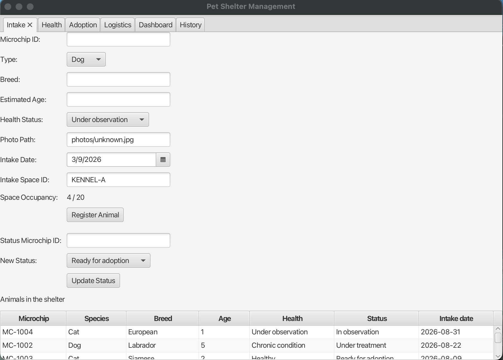
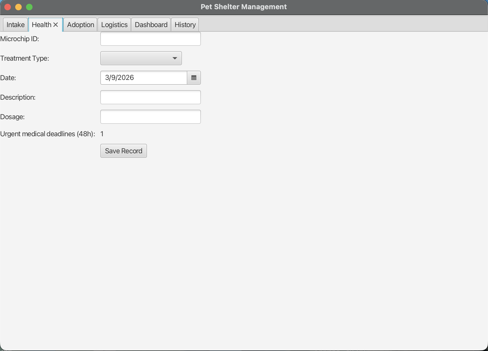
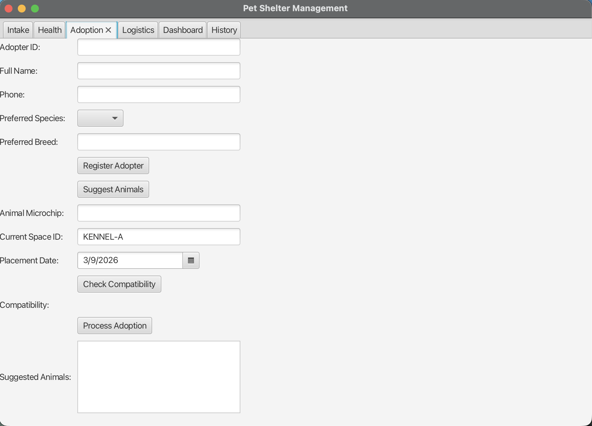
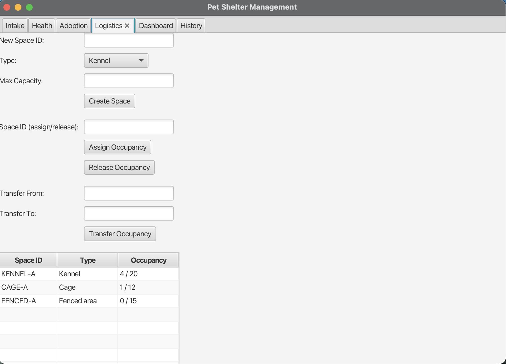
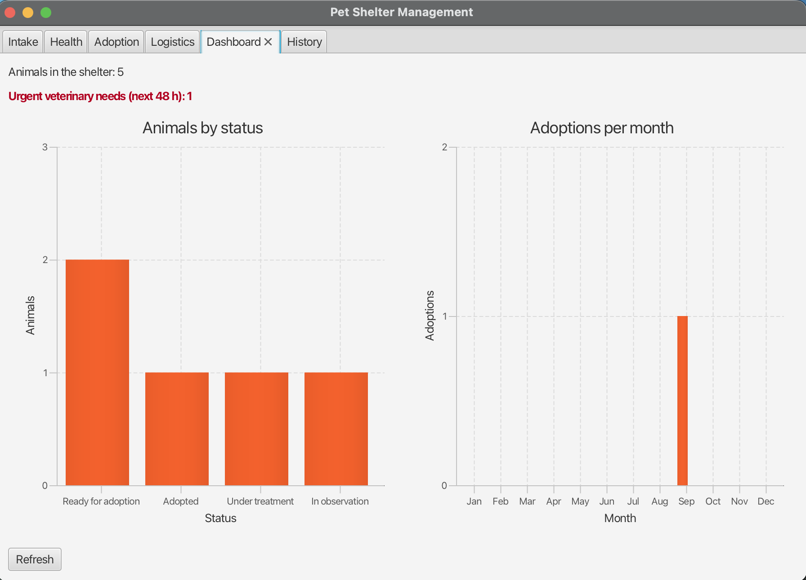
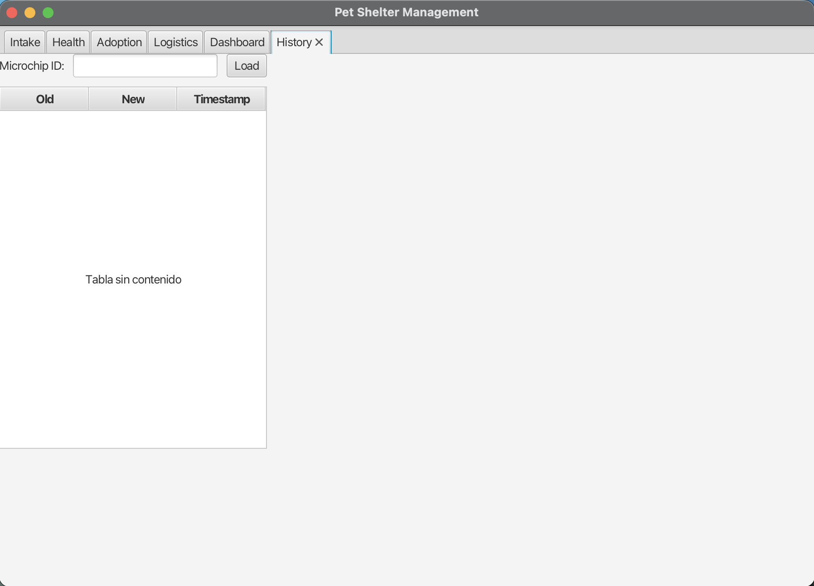

# User guide

**Pet Shelter and Adoption Management System** — Project 11, Software Engineering 2025/2026,
University of Cassino and Southern Lazio.

This guide is written for the reception desk of the shelter. It does not assume any previous
training with the application, and it covers the six modules in the order a normal working day
follows: an animal arrives, it is treated, it is placed with an adopter, it occupies a space,
and its history is consulted.

---

## 1. Starting the application

From the project root, with Java 21 and Maven installed:

```bash
mvn javafx:run
```

The window opens on the **Intake** tab. The database is created on the first launch under
`data/petshelter.mv.db`, and the application loads a small demo shelter — five animals, two
adopters, some health records and one closed adoption — so that every screen has something to
show from the beginning. The demo data is written only when the registry is empty, so it never
overwrites real work; to start from a clean shelter, close the application, delete the `data/`
folder and launch it again, or start it with `-Dshelter.demo=false`.

---

## 2. Intake — registering an animal and seeing the shelter



**To register an animal that has just arrived:**

1. Fill in the **Microchip ID**. It is the identifier of the animal in the whole application and
   cannot be repeated.
2. Choose **Type** (Dog or Cat), and write the **Breed** and the **Estimated Age** in years.
3. Choose the **Health Status** it arrives with.
4. Leave the **Intake Date** as today unless you are registering an older arrival.
5. Write the **Intake Space ID** where the animal is placed. `KENNEL-A`, `CAGE-A` and `FENCED-A`
   exist from the first launch; the label **Space Occupancy** next to it shows how full that
   space is, for example `4 / 20`.
6. Press **Register Animal**.

The animal is created with the status *In observation*, the occupancy of the space goes up by
one, and the animal appears at the top of the table.

**To change the status of an animal:** click its row in the table at the bottom. Its microchip
and its current status are copied into the **Status Microchip ID** and **New Status** fields.
Choose the new status and press **Update Status**. Every change is written to the history.

The table lists the animals of the shelter with the most recent intake first, so the animals
that arrived today are always the first ones on screen.

---

## 3. Health — treatments and the 48-hour alert



**To record a treatment:**

1. Write the **Microchip ID** of the animal.
2. Choose the **Treatment Type**: vaccine, parasite treatment, veterinary visit or diet.
3. Set the **Date**. For a vaccine, this is the date it is due.
4. Write a short **Description** and the **Dosage**, which must be a positive number.
5. Press **Save Record**.

**Urgent medical deadlines (48h)** counts the treatments that fall inside the next two days,
diets excluded. It is the number the veterinarian checks first thing in the morning.

---

## 4. Adoption — adopters and placements



**To register an adopter:** fill in **Adopter ID**, **Full Name**, **Phone**, the
**Preferred Species** and, if there is one, the **Preferred Breed**. Press **Register Adopter**.

**To find an animal for an adopter:** write the **Adopter ID** and press **Suggest Animals**.
The list shows only the animals that are ready for adoption *and* match the preferences of that
adopter. Clicking a suggestion copies its microchip into the **Animal Microchip** field. If the
list comes back empty, there is no compatible animal available at the moment.

**To close an adoption:**

1. Check that **Animal Microchip** and **Adopter ID** are filled in.
2. Press **Check Compatibility** to confirm the pairing. The result appears next to
   **Compatibility**.
3. Write the **Current Space ID** the animal is leaving and set the **Placement Date**.
4. Press **Process Adoption**.

The adoption, the new status of the animal and the entry in the history are written together:
either the three of them are saved or none of them is, so an interrupted adoption never leaves
the shelter data half-updated.

---

## 5. Logistics — the spaces of the shelter



The table at the bottom shows every space with its type and its occupancy over its capacity.

- **To create a space:** write the **New Space ID**, choose the **Type** (kennel, cage or fenced
  area), write the **Max Capacity** and press **Create Space**.
- **To move one animal in or out of a space:** write the **Space ID (assign/release)** and press
  **Assign Occupancy** or **Release Occupancy**.
- **To move an animal between spaces:** write **Transfer From** and **Transfer To** and press
  **Transfer Occupancy**.

A space can never go over its capacity: if it is full, the application refuses the assignment
and the occupancy stays as it was.

---

## 6. Dashboard — the state of the shelter



Three indicators, refreshed automatically after any change made in any tab:

- **Animals in the shelter** — how many animals the registry holds.
- **Urgent veterinary needs (next 48 h)** — shown in red while there is at least one deadline to
  attend, in green when there is none.
- **Animals by status** — how the animals are distributed over the lifecycle statuses.
- **Adoptions per month** — the adoptions closed in each month of the current year. All twelve
  months are drawn, also the empty ones, so the seasonality can be read at a glance.

The **Refresh** button repaints the charts on demand.

---

## 7. History — the audit trail of an animal



Write the **Microchip ID** of an animal and press **Load**. The table lists every status change
of that animal with the previous status, the new one and the moment it happened.

Entries are never modified or deleted: the history is written once, when the change happens, and
is the record that explains what happened to an animal and when.

---

## 8. When something is refused

The application validates before writing, and explains itself with a message on screen. The most
frequent ones:

| Message | What it means |
|---|---|
| *All intake fields are required* | One of the fields of the intake form is empty |
| *Estimated age must be numeric* | The age must be a whole number of years |
| *Microchip ID already exists* | Another animal is already registered with that microchip |
| *Animal not found* / *Adopter not found* | The identifier does not exist in the registry |
| *Kennel is at full capacity* | The space has reached its maximum capacity |
| *Dosage must be a valid number* | The dosage of a treatment must be a positive number |
| *Animal is not compatible with adopter preferences* | The species or the breed does not match what the adopter asked for |
| *Animal already adopted* | That animal has already been placed |
| *Placement date cannot be before intake date* | The adoption cannot be dated before the animal arrived |
| *No animal ready for adoption matches this adopter* | No available animal matches the preferences of that adopter |

Nothing is written when one of these appears, so the operation can simply be corrected and
repeated.
